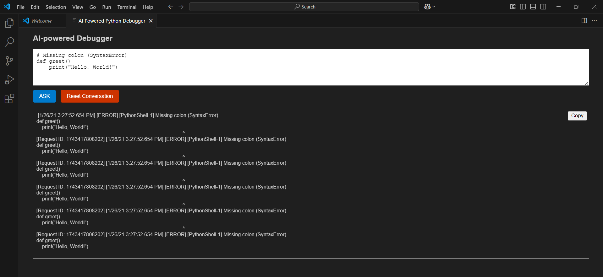
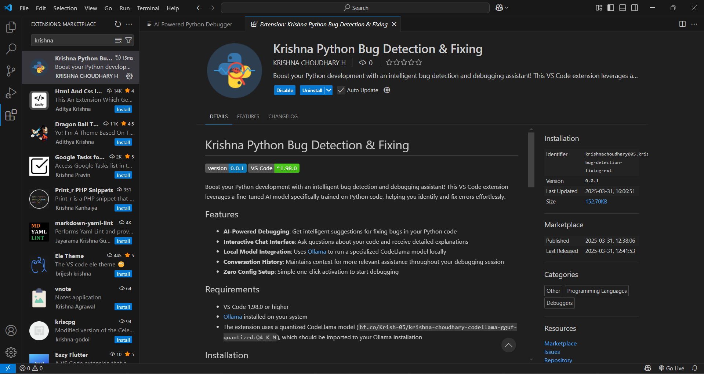

# Fine-Tuning in Large Language Models For Bug Detection and Fixing For Python Code

## Overview
This repository hosts theproject dedicated to Fine-Tuning in Large Language Models For Bug Detection and Fixing in Python. The project utilizes a custom dataset and innovative methods to enhance the LLM's capabilities in understanding and correcting code errors. Here are the topics in this project:
- [Dataset Description](#dataset-description)
- [Dataset Creation Process](#dataset-creation-process)
- [Model Description](#model-description)
- [Fine-Tuning](#fine-tuning)
- [Krishna Python Bug Detection & Fixing – VS Code Extension](#VSCode-extension)
- [Conclusion](#conclusion)
- [User Interface](#user-interface)
- [How to Use](#how-to-use)

## Dataset Description
The dataset, named `krish-bug-detect-fix`, is meticulously crafted to train and test LLMs specifically for bug detection and correction tasks. It comprises 25,793 rows, each containing:
- `original_code`: The buggy code snippet.
- `modified_code`: The corrected code snippet.
- `changed_line`: The specific line in the code where the bug was fixed.
- `number_of_line`: The line number of the corrected code.
- `mutation_type`: Type of bug introduced; includes Operation, Decision, Value, and Statement mutations.

This dataset was generated using Mutation Testing techniques to systematically introduce bugs into existing clean code. The types of mutations are designed to simulate common logical and syntactic errors developers might encounter.

    
    

## Dataset Creation Process
The dataset was curated through a semi-automated process:
1. **Code Extraction**: Clean code snippets were extracted from open-source repositories.
2. **Mutation Injection**: Bugs were introduced into the clean code using predefined mutation rules to alter specific parts of the code logically.
3. **Data Compilation**: Each entry in the dataset includes the bugged code, the fix, the location of the fix, and the type of mutation, prepared for LLM training and evaluation.

## Model Description
The backbone of our fine-tuning experiments is the [Unsloth CodeLlama-7B-BnB-4bit](https://huggingface.co/unsloth/codellama-7b-bnb-4bit) model, an optimized variant of Meta's CodeLlama designed for efficient natural language and code-related tasks. Leveraging 4-bit quantization via BitsAndBytes (BnB), this model balances performance and memory efficiency, making it well-suited for code generation, debugging, and software development automation. Its architecture enables rapid adaptation to various programming languages, enhancing its ability to assist in complex software engineering workflows.

## Fine-Tuning
In this project, fine-tuning is aimed at adapting the model to the coding domain, especially for bug detection and debugging. The model is trained on a dataset of code with errors and corresponding corrections, allowing it to learn patterns for identifying and fixing programming issues. The LoRA method is employed to efficiently adjust the model's weights, optimizing the fine-tuning process by reducing computational demand. This process enhances the model's ability to accurately detect and resolve bugs, ensuring it can provide effective code debugging suggestions while still generalizing well to other tasks. Fine-tuning, combined with LoRA, ensures that the model can handle the specific challenges of bug detection in programming with minimal resource requirements.

    
    

## Krishna Python Bug Detection & Fixing – VS Code Extension

## Overview
Boost your Python development with an intelligent bug detection and debugging assistant! **Krishna Python Bug Detection & Fixing** is a powerful VS Code extension designed to identify and resolve errors in Python code effortlessly. Leveraging a fine-tuned AI model specifically trained on Python debugging, this extension streamlines your development workflow, making error resolution faster and more intuitive.

## Features
- ✅ **Automatic Bug Detection** – Instantly detects syntax and logical errors in Python code.
- ✅ **AI-Powered Debugging** – Provides smart suggestions to fix common issues.
- ✅ **Seamless Integration** – Works directly within VS Code for a smooth coding experience.
- ✅ **Code Optimization** – Suggests improvements for cleaner and more efficient code.
- ✅ **User-Friendly Interface** – Highlights errors and fixes in real-time.

## Installation
1. Open **VS Code**.
2. Go to **Extensions** (`Ctrl + Shift + X`).
3. Search for **"Krishna Python Bug Detection & Fixing"**.
4. Click **Install**.
5. Restart VS Code if needed.

## Usage
1. Open a Python file in VS Code.
2. The extension will automatically analyze the code.
3. Errors and suggestions will be displayed in the **Problems** tab.
4. Apply the suggested fixes or refine the code based on AI recommendations.

## Known Issue: Infinite Loop on Buggy Code
Currently, the extension may enter an **infinite response loop** when processing certain buggy code. This issue is under investigation, and we are working on a fix. In the meantime, if you encounter this issue:
- Try stopping the execution manually (`Ctrl + C` or restarting VS Code).
- Modify the input to be more structured before running the extension.

## Upcoming Improvements
- 🔹 Fix for the infinite loop issue(Introduce a Timeout Mechanism,Implement a Debugging Confidence Score).
- 🔹 Enhanced AI model with better debugging capabilities.
- 🔹 More detailed explanations for code fixes.

## Conclusion
Fine-tuning the CodeLlama model enhances its ability to understand, generate, and debug Python code more accurately. By training it on domain-specific datasets, we improve its efficiency in identifying errors and providing precise fixes, making it a powerful tool for automated code analysis.

## User Interface

This user interface is designed for the "Krishna AI-powered Python Debugger" tool. It features a clean, minimalist layout with a multi-line text area where users can input their Python code or describe coding issues. Users interact with the extension via the prominent "ASK" button to submit queries, and the "Reset Conversation" button to start fresh debugging sessions. The response area displays AI-generated solutions with syntax highlighting for code snippets, while a convenient copy button allows users to easily transfer fixes to their codebase. The UI is optimized for VSCode integration, providing developers with contextual debugging assistance without disrupting their workflow.

    
    

## How to Use
To use the Krishna AI-powered Python Debugger extension, simply open the extension panel in VSCode, paste your problematic Python code or describe your issue in the text area, and click the "ASK" button to receive AI-generated debugging suggestions and fixes. Copy the solution directly to your clipboard with the copy button, or reset the conversation to start a new debugging session when needed.
