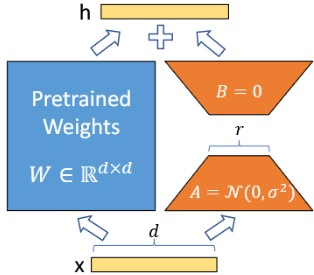
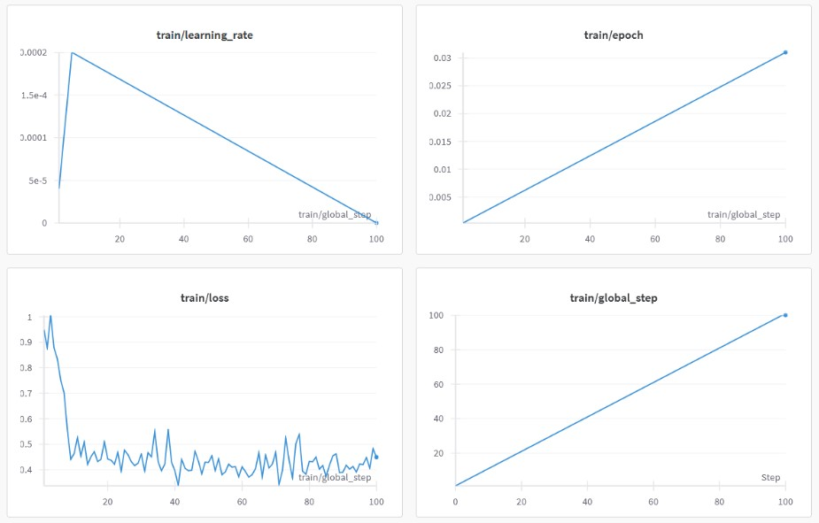

# Fine-Tuning in Large Language Models For Bug Detection and Fixing

## Overview
This repository hosts theproject dedicated to Fine-Tuning in Large Language Models For Bug Detection and Fixing in Python. The project utilizes a custom dataset and innovative methods to enhance the LLM's capabilities in understanding and correcting code errors. Here are the topics in this project:
- [Dataset Description](#dataset-description)
- [Dataset Creation Process](#dataset-creation-process)
- [Model Description](#model-description)
- [Fine-Tuning](#fine-tuning)
- [Conclusion](#conclusion)
- [User Interface](#user-interface)
- [How to Use](#how-to-use)

## Dataset Description
The dataset, named `krish-bug-detect-fix`, is meticulously crafted to train and test LLMs specifically for bug detection and correction tasks. It comprises 25,793 rows, each containing:
- `original_code`: The buggy code snippet.
- `modified_code`: The corrected code snippet.
- `changed_line`: The specific line in the code where the bug was fixed.
- `number_of_line`: The line number of the corrected code.
- `mutation_type`: Type of bug introduced; includes Operation, Decision, Value, and Statement mutations.

This dataset was generated using Mutation Testing techniques to systematically introduce bugs into existing clean code. The types of mutations are designed to simulate common logical and syntactic errors developers might encounter.

    
    

## Dataset Creation Process
The dataset was curated through a semi-automated process:
1. **Code Extraction**: Clean code snippets were extracted from open-source repositories.
2. **Mutation Injection**: Bugs were introduced into the clean code using predefined mutation rules to alter specific parts of the code logically.
3. **Data Compilation**: Each entry in the dataset includes the bugged code, the fix, the location of the fix, and the type of mutation, prepared for LLM training and evaluation.

## Model Description
The backbone of our fine-tuning experiments is the [Unsloth CodeLlama-7B-BnB-4bit](https://huggingface.co/unsloth/codellama-7b-bnb-4bit) model, an optimized variant of Meta's CodeLlama designed for efficient natural language and code-related tasks. Leveraging 4-bit quantization via BitsAndBytes (BnB), this model balances performance and memory efficiency, making it well-suited for code generation, debugging, and software development automation. Its architecture enables rapid adaptation to various programming languages, enhancing its ability to assist in complex software engineering workflows.

## Fine-Tuning
In this project, fine-tuning is aimed at adapting the model to the coding domain, especially for bug detection and debugging. The model is trained on a dataset of code with errors and corresponding corrections, allowing it to learn patterns for identifying and fixing programming issues. The LoRA method is employed to efficiently adjust the model's weights, optimizing the fine-tuning process by reducing computational demand. This process enhances the model's ability to accurately detect and resolve bugs, ensuring it can provide effective code debugging suggestions while still generalizing well to other tasks. Fine-tuning, combined with LoRA, ensures that the model can handle the specific challenges of bug detection in programming with minimal resource requirements.

    
    

