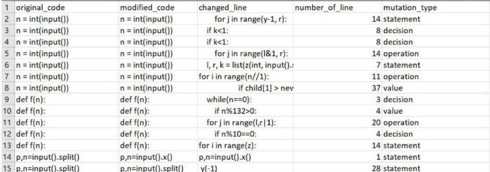
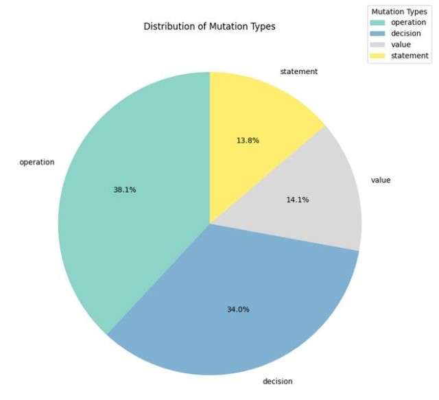

# Fine-Tuning in Large Language Models For Bug Detection and Fixing

## Overview
This repository hosts theproject dedicated to Fine-Tuning in Large Language Models For Bug Detection and Fixing in Python. The project utilizes a custom dataset and innovative methods to enhance the LLM's capabilities in understanding and correcting code errors. Here are the topics in this project:
- [Dataset Description](#dataset-description)
- [Dataset Creation Process](#dataset-creation-process)
- [Model Description](#model-description)
- [Prompt Engineering](#prompt-engineering)
- [Fine-Tuning](#fine-tuning)
- [Evaluation Metrics](#evaluation-metrics)
- [Conclusion](#conclusion)
- [User Interface](#user-interface)
- [How to Use](#how-to-use)

## Dataset Description
The dataset, named `krish-bug-detect-fix`, is meticulously crafted to train and test LLMs specifically for bug detection and correction tasks. It comprises 25,793 rows, each containing:
- `original_code`: The buggy code snippet.
- `modified_code`: The corrected code snippet.
- `changed_line`: The specific line in the code where the bug was fixed.
- `number_of_line`: The line number of the corrected code.
- `mutation_type`: Type of bug introduced; includes Operation, Decision, Value, and Statement mutations.

This dataset was generated using Mutation Testing techniques to systematically introduce bugs into existing clean code. The types of mutations are designed to simulate common logical and syntactic errors developers might encounter.

    
    

